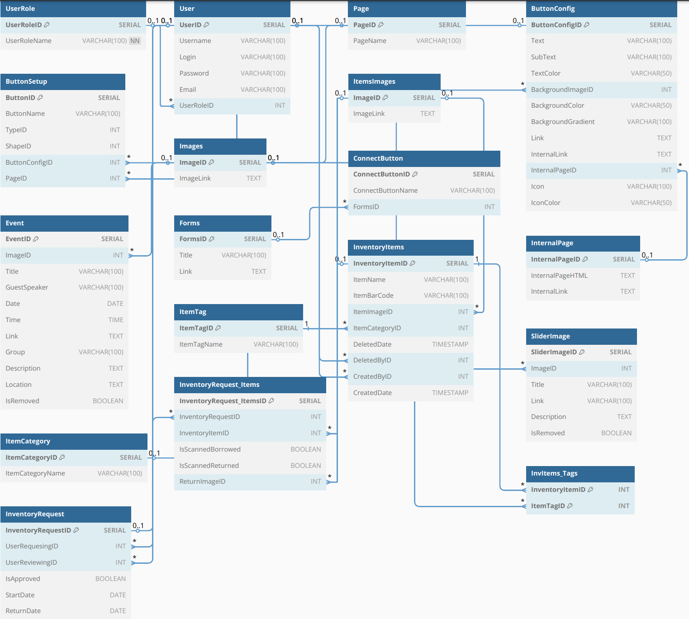
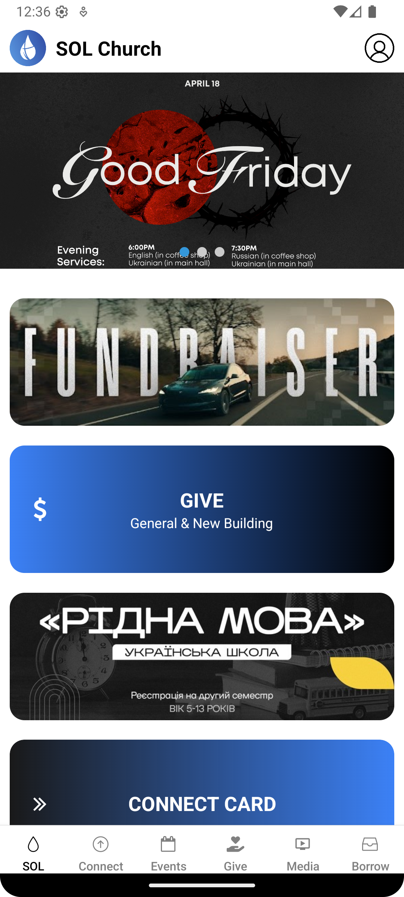
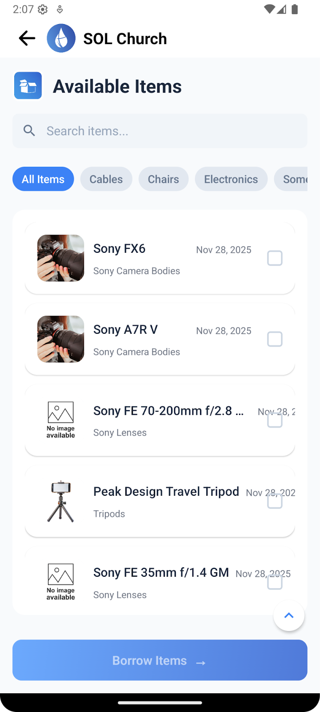
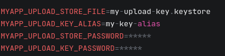
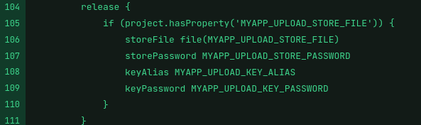
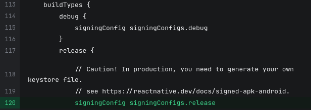

#  SOL Church Mobile App
This app is a cross-platform mobile application for Sacramento's [Spring Of Life Church](https://www.solsacramento.com/). Our team has been tasked with recreating SOL's current mobile app so the church can reduce costs and reliance on external application hosting services. The church will gain full control over any systems, services, and feature integrations within the app. In addition, the app will have a new item borrow system for users to borrow and return items from the church, and inventory management for the church to easily track and manage any items in possession of the church and users.

## Features
- Users can view current events and services offered by the church on various pages throughout the app
- If a user is logged in, they'll have access to the borrow feature
	- Ability to search for items in the church's inventory
	- Select and request items to borrow
	- Return items that a user has borrowed
- UI and layout of the app closely resembles the current app so current users will be familiar
- Admins can monitor and manage inventory and any items that have been borrowed
- Admins can manage and update events and services throughout the app

## Contents
- [Features](#features)
- [ERD & Examples](#resources-and-examples)
- [Development](#development)
- [Testing](#testing)
- [Deployment](#deployment)

## Resources and Examples
### Entity Relationship Diagram (ERD)


### App Screen Shots
<table>
  <tr>
    <td align="center">
      <br>
      <strong>Homepage</strong>
    </td>
    <td align="center">
      <br>
      <strong>Borrow Page</strong>
    </td>
  </tr>
</table>


## Development
### Dependencies
- @babel/core@7.28.5
- @expo/ngrok@4.1.3
- @hcaptcha/react-hcaptcha@1.14.0
- @hcaptcha/react-native-hcaptcha@10
- @react-native-async-storageasync-storage@2.2.0
- @react-native-community/cli@20.0.2
- @react-native/virtualized-lists@0.82.1
- @supabase/supabase-js@2.81.1
- @testing-library/jest-native@5.4.3
- @testing-library/react-native@13.3.3
- @types/axios@0.9.36
- @types/jest@29.5.14
- @types/react-test-renderer@19.1.0
- @types/react@19.0.14
- docker@1.0.0
- eslint-config-expo@9.2.0
- eslint@9.39.1
- expo-application@6.1.5
- expo-blur@14.1.5
- expo-calendar@15.0.7 extraneous
- expo-camera@16.1.11
- expo-constants@17.1.7
- expo-dev-client@5.2.4
- expo-device@7.1.4
- expo-font@13.3.2
- expo-haptics@14.1.4
- expo-linear-gradient@14.1.5
- expo-linking@7.1.7
- expo-location@18.1.6
- expo-maps@0.11.0
- expo-notifications@0.31.4
- expo-router@5.1.7
- expo-secure-store@14.2.4
- expo-splash-screen@0.30.10
- expo-status-bar@2.2.3
- expo-symbols@0.4.5
- expo-system-ui@5.0.11
- expo-web-browser@14.2.0
- expo@53.0.23
- jest-expo@53.0.10
- jest@29.7.0
- moment@2.30.1 extraneous
- native@0.2.0
- pod-install@0.3.10
- react-dom@19.0.0 overridden
- react-native-add-calendar-event@5.0.0 extraneous
- react-native-asset@2.1.1
- react-native-elements@3.4.3
- react-native-gesture-handler@2.24.0
- react-native-get-random-values@1.11.0
- react-native-modal@14.0.0-rc.1
- react-native-reanimated-carousel@4.0.3
- react-native-reanimated@3.17.5
- react-native-safe-area-context@5.4.0
- react-native-screens@4.11.1
- react-native-url-polyfill@2.0.0
- react-native-vector-icons@10.3.0
- react-native-web@0.20.0
- react-native-webview@13.13.5
- react-native@0.79.6
- react-test-renderer@19.0.0
- react@19.0.0 overridden
- ts-jest@29.4.5
- ts-node@10.9.2
- typescript@5.8.3

### Setup
1. Install Required Global Tools
	- Use Node.js (LTS recommended)
	- You will need the Expo CLI (npm install -g expo-cli)

	- Depending on your machine:
		- For Windows/Linux:
			- Install Android Studio
			- Install Android SDK + Platform Tools
			- Set environment variables:
				- ANDROID_HOME = C:\Users\YourName\AppData\Local\Android\Sdk
			Install JDK 17
		- For macOS:
			- brew install watchman

2. Clone The Project
	- git clone git@github.com:Senior-Project-Team-Buildabyte/SOL-Church-App.git
	cd SOL-Church-App

3. Install Project Dependencies
	- npm install

	- There are some "extraneous" items, they are in node_modules but not in package.json. If needed run:
		- npm install expo-calendar moment react-native-add-calendar-event

4. Environement Variables (.env)
	- Create .env in project root
	- It should follow this format:
		- EXPO_PUBLIC_SUPABASE_URL=YOUR_SUPABASE_URL
		- EXPO_PUBLIC_SUPABASE_ANON_KEY=YOUR_SUPABASE_ANON_KEY

### Running
1. Running on a Real Device
	- Download Expo Go:
		- Either in iOS App Store or Google Play Store
	- Then:
		- Run expo start
		- Scan the QR code

2. Running on Emulator (Android Studio)
	- Start Metro & Build & Run with Expo - make sure to start emulator first
		- npx expo run:android

## Testing

**Jests Unit Tests Commands**

Run All Unit Tests:

```bash
npx jest
```
<br>
Run Single Test Suite:

```bash
npx jest path/to/testfile.test.tsx
```
<br>
Example:

```bash
npx jest app/testing/home/home.test.tsx
```
<br>

**Maestro Automated Tests**

Before running Maestro tests, ensure the following:

- Maestro must be installed on your machine (not included in project dependencies)
	- **Installation steps vary by OS**
- Java 17 is required as a prerequisite
   - This can be checked with the command: ```java -version```  

**Install Maestro:**

macOS:
```bash
curl -fsSL "https://get.maestro.mobile.dev" | bash
```
<br>
Windows:
<br>
Follow the Instructions at https://docs.maestro.dev/getting-started/installing-maestro/windows
<br>
<br>

Verify installation:

```bash
maestro --version
```
<br>

**Emulator has to be running before running maestro test**

Run Full Maestro Test Flow:

```bash
maestro test maestro/flow.yaml
```
<br>
Run Specific Maestro Test File:

```bash
maestro test path/to/test.yaml
```
<br>
Example:

```bash
maestro test app/testing/home/home.yaml
```
<br>

## Deployment
### For Local Builds
- For building locally without EAS, first you must ensure you have an android directory generated. Expo-dev-cli is already installed in the system so running `npx expo prebuild` will generate an android directory that will later be used for building the .apk and .aab files to be submitted to the Google Play Store.
- After making sure the android directory has been generated, in a terminal you need to ensure your package is signed with an upload key. (*This tool is included with OpenJDK 17.*)
	- To generate an upload key (for Windows use WSL2) use the following command:\
	`sudo keytool -genkey -v -keystore my-upload-key.keystore -alias my-key-alias -keyalg RSA -keysize 2048 -validity 10000`
	This will prompt you for a password, make sure to save it as you will need it in the next step.
- Next, ensure that the keystore you created (in this example: `my-upload-key.keystore`) is located inside of the app folder inside of the project’s android directory and that you update gradle.properties with the following:


\* *Replace my-upload-key.keystore, my-key-alias with the arguments you provided above. Replace the ‘\*\*\*\*\*’ with the password you set after generating the upload key.*
- Finally to finish the setup, you need to add the following to ‘app/build.gradle’ inside ‘signingConfigs {...}’


And ‘buildTypes {...}’



\* *The line “signingConfig signingConfigs.release” replaces “signingConfig signingConfigs.debug” under ‘release’.*

- Now the steps diverge whether you are using Windows, WSL2, or Linux to generate the build. Both are performed while inside the android directory.

  - If using WSL2 or Linux, run the following:

    - For Android App Bundles ‘.aab’ (what you typically submit to the Play Store):\
      `./gradlew bundleRelease`

    - For .apk files (sideloading or testing):\
      `./gradlew assembleRelease
      `

  - If using Windows (without WSL2):
    - For Android App Bundle:\
    `gradlew bundleRelease`

    - For .apk files:\
    `gradlew assembleRelease`

- From here you can submit your signed app bundle (.aab) to the Google Play Store following these guidelines\*: <https://github.com/expo/fyi/blob/main/first-android-submission.md>\
    \*_As full deployment has been requested to be withheld by the client, we assume the client knows or can utilize the guide above to ensure their first submission of the application is successful._

  - If distributing the application through a privately owned website, upload the .apk for download and ensure any users understand how to install 3rd-party .apk’s by enabling the Android Developer options when asked.

    - The .aab file can be located inside the following path ‘android > app > build > outputs > bundle > release’ 

  - For sideloading as will be done for demonstration, download or transfer the generated .apk to the desired device, navigate to it within the files, and install from there (once again making sure to enable the Android Developer mode for 3rd-party .apk’s).

    - The .apk file can be located inside the following path ‘android > app > build > outputs > apk > release’


## Contributors
- Dylan Prosser (dprosser@csus.edu)
- Dylan Keener (dkeener@csus.edu)
- Iryna Olkhovyk (iolkhovyk@csus.edu)
- Brian Reyna (brianreyna@csus.edu)
- Kanageshwaran Dhakshinamoorthy (kdhakshinamoorthy@csus.edu)
- Tarrin Gackstetter (tgackstetter@csus.edu)
- Z Wiese (zwiese@csus.edu)
