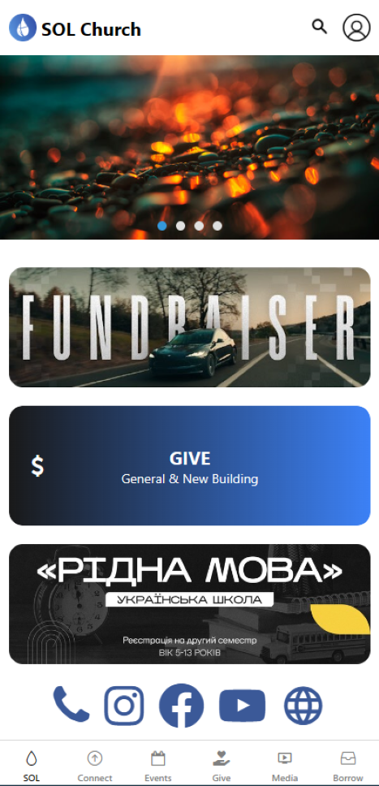
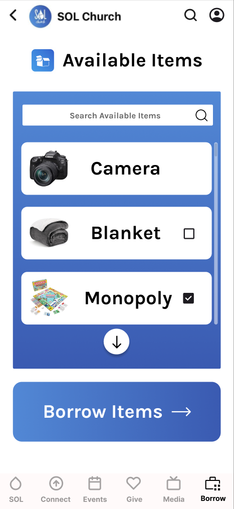

#  SOL Church Mobile App
This app is a cross-platform mobile application for Sacramento's [Spring Of Life Church](https://www.solsacramento.com/). Our team has been tasked with recreating SOL's current mobile app so the church can reduce costs and reliance on external application hosting services. The church will gain full control over any systems, services, and feature integrations within the app. In addition, the app will have a new item borrow system for users to borrow and return items from the church, and inventory management for the church to easily track and manage any items in possession of the church and users.

## Features
- Users can view current events and services offered by the church on various pages throughout the app
- If a user is logged in, they'll have access to the borrow feature
	- Ability to search for items in the church's inventory
	- Select and request items to borrow
	- Return items that a user has borrowed
- UI and layout of the app closely resembles the current app so current users will be familiar
- Admins can monitor and manage inventory and any items that have been borrowed
- Admins can manage and update events and services throughout the app

## Contents
- [Features](#features)
- [ERD & Examples](#resources-and-examples)
- [Timeline](#timeline)
- [Development](#development-placeholder)
- [Testing](#testing-placeholder)
- [Deployment](#deployment-placeholder)

## Resources and Examples
### Entity Relationship Diagram (ERD)

### App Prototype
 &emsp; 

## Timeline
|Sprint|Date|Deliverables|
|-:|:-:|-|
|1|Feb 17 - Mar 2|MVP Defined, user stories and project backlog created|
|2|Mar 3 - Mar 16|Homepage layout and dynamic events/announcements list created|
|||Started header and events page|
|3|Mar 17 - Mar 30|Featured events carousel, carousel animation, and header implemented|
|||Improved buttons and UI, started connect page|
|4|Apr 7 - Apr 20|Finish connect page, and update carousel, events and resources|
|||Implement forms and media pages, finish framework for most basic pages|
|**Future**|**Estimated date**|**Planned deliverables**|
|5|Sept|User login/authentication, continue any major UI developments (borrow page, etc.)|
|6|Sept - Oct|Notification service created, finalize any basic UI changes and general app behavior|
|||Start any backend development and service implementations|
|7|Oct - Nov|Finish implementation of any user accessible pages|
|||Start work on admin access and app control, continue needed backend development|
|8|Nov|Finish any admin pages and implement app control for admins|
|||Finish backend service access to update any information within the app|
|||Finish any needed development work to finalize app for deployment|

## Development (placeholder)
### Dependencies
(list of dependencies)

### Setup
(steps to setup the project and dev environment)

### Running
(steps to run the app)

## Testing (placeholder)
(testing instructions)

## Deployment (placeholder)
(deployment instructions)
